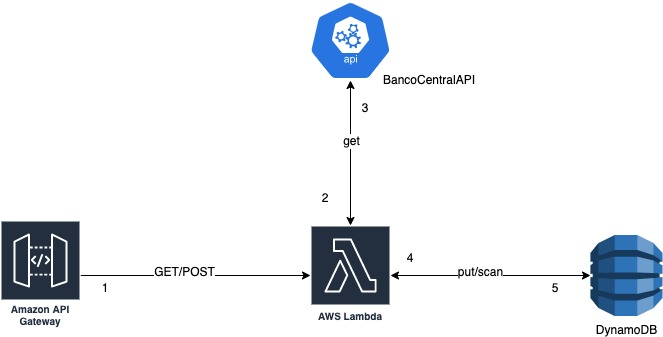
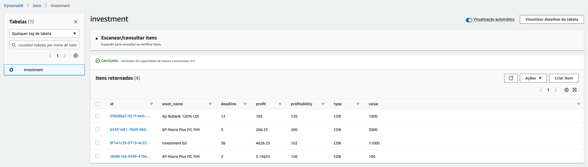

# FIAP Avaliação Final - Serverless Architecture

### Projeto é uma Lambda Function da AWS, feita em Node.JS 16.x

> **Solução:**
> 
> É uma aplicação para calcular lucratividade baseada no CDI.
>
> A requisição chega até o API gateway criado, é direcionada a 
> Lambda Function que se integra com a API pública do banco central
> para consultar o valor atual do CDI. Realiza o calculo e persiste as infomações em um DinamoDB.

## Para executar o projeto foi utilizado:

### 1 - [AWS CLI](https://docs.aws.amazon.com/cli/latest/userguide/getting-started-install.html) e [SAM CLI](https://docs.aws.amazon.com/serverless-application-model/latest/developerguide/serverless-sam-cli-install.html).

### 2 - Configure AWS e o SAM com sua conta AWS
* #### Com o SAM, é possível executar a Lambda Function localmente.

### 3 - Utilize os comandos para buildar e realizar o deploy:
  
 ~~~shell
  sam build
 ~~~

 ~~~shell
  sam deploy -g
 ~~~

### 4 - Crie uma tabela no DynamoDB com o nome "investment"

### 5 - Após a criação e deploy, dê a permissão a função da sua Lambda para ter acesso ao seu DynamoDB no IAM.

* #### Na pasta raiz do projeto está a collection do Postman para executar o projeto.